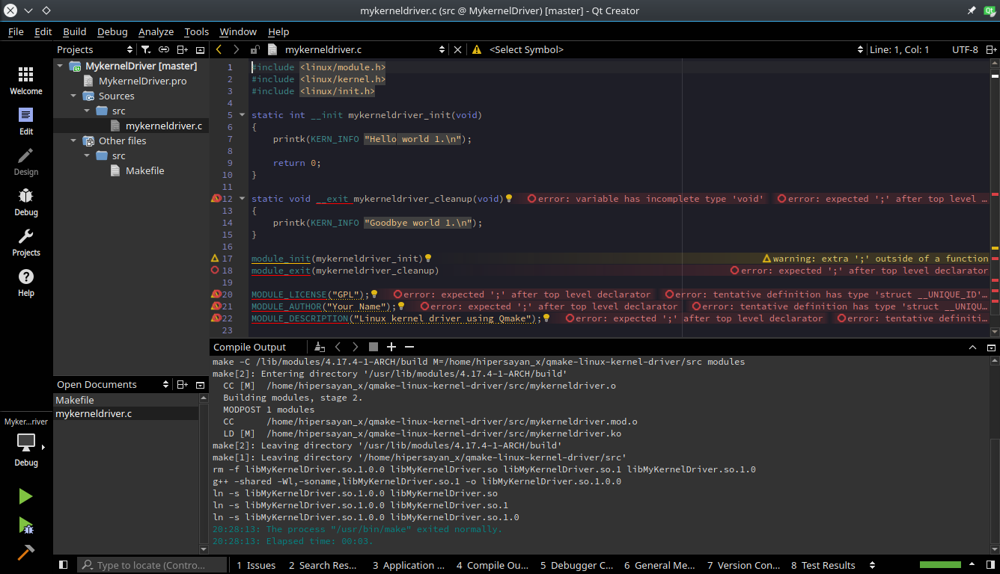

This is a basic skeleton for developing a Linux driver using modern tools and facilities provided by Qt Creator, like static code analysis, code refactoring and search, issue tracking. It will also allow to integrate the driver code into existing Qt projects cleanly.  
The qmake wrapper does not adds new code or define new macros to the driver code, so the resulting driver code can be integrated cleanly into Linux code tree (except for qmake files).  

# WARNING: Use this skeleton for your own projects, DON'T EVEN try to PR a qmake file or similar things to the main Linux tree, or you will be most probably be kicked out. Only PR driver related source code. You MUST follow Linux kernel development rules when PRing there. #

## Notes ##

Clang static analyzer will issue some errors and warnings even when the code compile fine (and it's fine), don't worry Clang is not used to parse kernel code yet.  
The qmake .pro file is defined as a library target, when compiling, it will generate some _.so_ files in the root folder, those files are garbage, the real driver is generated as a _.ko_ file in _src_ folder.  
In this skeleton _src/Makefile_ and _src/mykerneldriver.c_ are the driver related source code.  
[Linux API is not stable](https://www.kernel.org/doc/html/latest/process/stable-api-nonsense.html), so if you want to distribute your diver outside linux kernel tree, you must distribute the source code of the driver instead of the binary file, unless you are targeting a very specific device and kernel, otherwise it will not work.  
You can't use user space libraries in kernel space development, so forget about using things like _stdio.h_, _math.h_ and so.  
And last but not least [RTFM](https://www.kernel.org/doc/html/latest/).

## Documentation ##

[qmake Manual](https://doc.qt.io/qt-5/qmake-manual.html)  
[The Linux Kernel Module Programming Guide](http://www.tldp.org/LDP/lkmpg/2.6/html/index.html)
[The Linux Kernel documentation](https://www.kernel.org/doc/html/latest/)
